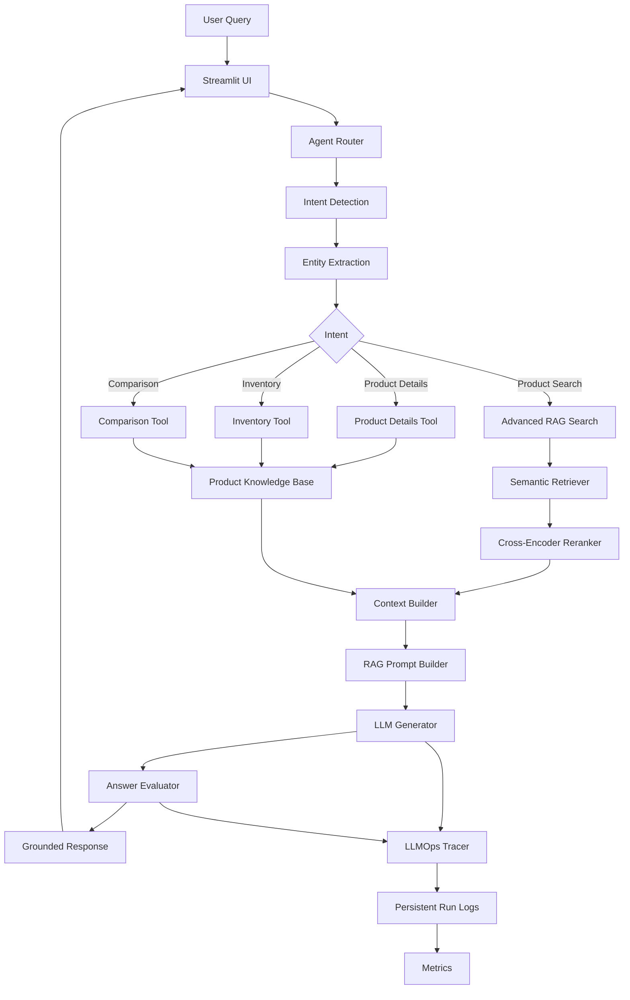

# LLMOps E-Commerce Assistant

## Advanced RAG-Based Intelligent E-Commerce Assistant

An end-to-end **LLMOps-enabled e-commerce assistant** that combines Retrieval-Augmented Generation (RAG), semantic search, Cross-Encoder reranking, tool-based agent orchestration, LangGraph workflows, grounded response generation, answer evaluation, persistent tracing, and operational metrics.

The system is designed to answer product-related questions using a controlled product knowledge base while maintaining traceability across the complete query-to-response pipeline.

---

## Project Overview

Traditional e-commerce search systems primarily depend on keyword matching and static filters. They often struggle with natural-language queries such as:

* "I need an Apple laptop under ₹90,000"
* "Which wireless headphones are available?"
* "Compare MacBook Air M2 and Galaxy Tab S9"
* "How many MacBook Air M2 units are in stock?"
* "Tell me the specifications of Galaxy Tab S9"

This project addresses these limitations by combining:

**Natural Language Understanding + Retrieval + Reranking + Agent Routing + Grounded Generation + Evaluation + LLMOps Monitoring**

The assistant retrieves relevant product information from the product knowledge base and generates responses using only the retrieved context.

---

# Key Capabilities

### Intelligent Product Search

Understands natural-language product queries and retrieves relevant products using semantic similarity.

### Semantic Retrieval

Uses transformer-based embeddings to represent products and queries in vector space.

### Cross-Encoder Reranking

Reranks retrieved candidates using a Cross-Encoder to improve the relevance of the final context.

### Query Understanding

Extracts structured constraints such as:

* Brand
* Category
* Minimum price
* Maximum price

Example:

```text
I need an Apple laptop under ₹90,000
```

Parsed as:

```text
Brand      : Apple
Category   : Laptop
Max Price  : ₹90,000
```

### Agent-Based Routing

The system identifies the user's intent and dynamically routes the request to the appropriate tool.

Supported intents:

```text
Product Search
Product Details
Inventory
Comparison
```

### LangGraph Orchestration

The agent workflow is implemented as a graph consisting of:

```text
User Query
     ↓
Router
     ↓
Entity Extraction
     ↓
Intent-Specific Tool
     ↓
Context Builder
     ↓
RAG Prompt
     ↓
LLM Generator
     ↓
Answer Evaluation
     ↓
Final Response
```

### Grounded Generation

The response generation layer is constrained by the retrieved product context.

The system is designed to avoid introducing product information that is not present in the supplied context.

### Answer Evaluation

Generated responses are evaluated against the retrieved context using a deterministic grounding evaluator.

The evaluation identifies:

* Supported claims
* Unsupported claims
* Grounding score
* Evaluation status

### Retrieval Evaluation

The retrieval pipeline supports evaluation using:

* Recall@K
* Precision@K
* Hit Rate

### LLMOps Monitoring

Each execution can be traced and recorded with:

* Run ID
* Query
* Intent
* Tool execution
* Context size
* Prompt size
* Response size
* Latency
* Grounding score
* Evaluation status

Execution traces are persisted in:

```text
logs/runs.jsonl
```

### Operational Metrics

The monitoring layer provides aggregated metrics including:

* Total runs
* Average latency
* Minimum latency
* Maximum latency
* Intent distribution
* Average context size
* Average prompt size
* Average response size

---

# System Architecture



---

# RAG Pipeline

The core retrieval pipeline follows a multi-stage architecture.

## 1. Data Ingestion

Raw product data is stored in:

```text
data/raw/products.csv
```

The ingestion pipeline performs:

* Data loading
* Data cleaning
* Missing-value validation
* Structured product preparation

Processed data is stored in:

```text
data/processed/products_clean.csv
```

---

## 2. Embedding Generation

Each product is converted into a semantic vector using:

```text
sentence-transformers/all-MiniLM-L6-v2
```

The generated embeddings are stored in:

```text
data/processed/product_embeddings.npy
```

Current embedding dimensionality:

```text
384
```

---

## 3. Semantic Retrieval

The user query is converted into an embedding and compared against product embeddings.

The retriever returns the most relevant candidates.

Example:

```text
Query:
wireless headphones
```

Possible retrieved products:

```text
WH-CH520
AirPods 4
Galaxy Buds FE
```

---

## 4. Cross-Encoder Reranking

Retrieved candidates are further evaluated using:

```text
cross-encoder/ms-marco-MiniLM-L6-v2
```

The Cross-Encoder evaluates the relationship between:

```text
Query + Product
```

and produces relevance scores.

This provides a second-stage ranking mechanism after initial semantic retrieval.

---

## 5. Context Construction

The selected product information is converted into a structured context.

Example:

```text
Product: MacBook Air M2
Brand: Apple
Category: Laptop
Price: ₹84,999
Rating: 4.7
Stock: 8
Description: Lightweight laptop with Apple M2 chip...
```

---

## 6. Grounded Prompt Construction

The retrieved context and user query are combined into a controlled RAG prompt.

The generation layer is instructed to:

* Use only supplied product context
* Avoid unsupported information
* Clearly state when information is unavailable
* Provide relevant product attributes
* Keep responses concise and useful

---

# Agent Architecture

The project uses tool-based agent orchestration.

## Intent Router

The router classifies incoming queries into:

```text
product_search
product_details
inventory
comparison
```

---

## Entity Extraction

Known product entities are identified from user queries.

Example:

```text
Compare MacBook Air M2 and Galaxy Tab S9
```

Entities:

```text
Product 1: MacBook Air M2
Product 2: Galaxy Tab S9
```

---

# Agent Tools

## Product Search Tool

Used for semantic product discovery.

```text
Query
 ↓
Retriever
 ↓
Reranker
 ↓
Relevant Products
```

---

## Product Details Tool

Retrieves complete information about a specific product.

Example:

```text
Tell me the specifications of Galaxy Tab S9
```

Returns information such as:

```text
Product
Brand
Category
Price
Rating
Stock
Description
```

---

## Inventory Tool

Handles inventory-related queries.

Example:

```text
How many MacBook Air M2 units are currently in stock?
```

Returns the current inventory information from the product dataset.

---

## Comparison Tool

Supports structured comparison between two products.

Example:

```text
Compare MacBook Air M2 and Galaxy Tab S9
```

The system retrieves both products and presents their attributes for comparison.

---

# LangGraph Workflow

The agent workflow is implemented using LangGraph.

```text
START
  ↓
Router Node
  ↓
Entity Extraction Node
  ↓
 ┌───────────────┬────────────────┬────────────────┬────────────────┐
 ↓               ↓                ↓                ↓
Search         Details         Inventory       Comparison
 ↓               ↓                ↓                ↓
 └───────────────┴────────────────┴────────────────┴────────────────┘
                         ↓
                   Response Node
                         ↓
                  Answer Evaluation
                         ↓
                        END
```

This structure allows the system to separate:

* Query understanding
* Tool selection
* Data retrieval
* Context construction
* Response generation
* Evaluation
* Monitoring

---

# LLMOps Layer

The project extends beyond a traditional RAG application by incorporating an LLMOps monitoring layer.

## Trace Lifecycle

Each query creates a trace.

```text
Query
 ↓
Router
 ↓
Tool
 ↓
Context
 ↓
Prompt
 ↓
LLM
 ↓
Evaluation
 ↓
Trace Completion
```

---

## Persistent Logging

Execution traces are stored in:

```text
logs/runs.jsonl
```

Each execution can contain information such as:

```text
run_id
query
events
latency
intent
context_size
prompt_size
response_size
grounding_score
evaluation_status
```

---

# Evaluation Framework

## Retrieval Evaluation

The retrieval evaluator measures:

### Recall@K

Measures whether relevant products are successfully retrieved within the top K results.

### Precision@K

Measures the proportion of retrieved results that are relevant.

### Hit Rate

Measures whether at least one relevant product appears in the retrieved results.

Example evaluation:

```text
Evaluation Dataset:
3 test queries

Average Recall@5 : 1.00
Average Precision@5 : 0.40
Average Hit Rate : 1.00
```

These values are based on the current small manually labeled evaluation set and are intended for project-level evaluation rather than production benchmarking.

---

# Answer Evaluation

The answer evaluator checks whether generated claims are supported by the retrieved context.

Example grounded response:

```text
The MacBook Air M2 is an Apple laptop.
It costs ₹84,999 and has a rating of 4.7.
```

If these attributes exist in the retrieved context:

```text
Grounding Score: 1.00
Status: GROUNDED
```

Unsupported information is identified separately.

The current evaluator is a lightweight deterministic evaluator designed for project-level validation rather than a production-grade semantic hallucination detector.

---

# Dataset

The current demonstration dataset contains product information across multiple categories.

Categories include:

```text
Laptop
Headphones
Mouse
Keyboard
Tablet
Power Bank
```

Example products include:

```text
IdeaPad Slim 3
Vivobook 15
Inspiron 15
Galaxy Book4
MacBook Air M2
WH-CH520
AirPods 4
Galaxy Buds FE
MX Master 3S
Magic Mouse
K380 Keyboard
Galaxy Tab S9
iPad 10th Gen
Redmi Pad Pro
PowerCore 20K
```

Each product contains:

```text
Product ID
Product Name
Category
Brand
Description
Price
Rating
Stock
```

---

# Example Queries

## Product Search

```text
I need an Apple laptop under ₹90,000
```

## Category Search

```text
Show me wireless headphones
```

## Product Details

```text
Tell me the specifications of Galaxy Tab S9
```

## Inventory

```text
How many MacBook Air M2 units are currently in stock?
```

## Comparison

```text
Compare MacBook Air M2 and Galaxy Tab S9
```

---

# Technology Stack

## Programming

```text
Python 3.11
```

## Data Processing

```text
Pandas
NumPy
```

## Machine Learning / Retrieval

```text
Sentence Transformers
Transformers
PyTorch
Cross-Encoder
```

## Generative AI Architecture

```text
RAG
LLM Prompt Engineering
Grounded Generation
```

## Agent Orchestration

```text
LangGraph
Tool-Based Agents
Intent Routing
Entity Extraction
```

## Evaluation

```text
Retrieval Evaluation
Answer Grounding Evaluation
Recall@K
Precision@K
Hit Rate
```

## LLMOps

```text
Tracing
Persistent Logging
Latency Monitoring
Run Metrics
Grounding Metrics
```

## Interface

```text
Streamlit
```

## Containerization

```text
Docker
```

## Version Control

```text
Git
GitHub
```

---

# Project Structure

```text
LLMOPS_E-COMMERCE/
│
├── app/
│   ├── advanced_rag.py
│   ├── agent_executor.py
│   ├── agent_router.py
│   ├── build_index.py
│   ├── context_builder.py
│   ├── embeddings.py
│   ├── complete_rag.py
│   ├── filters.py
│   ├── query_parser.py
│   ├── rag_pipeline.py
│   ├── rag_prompt.py
│   ├── retriever.py
│   ├── reranker.py
│   ├── search.py
│   │
│   ├── agent/
│   │   ├── graph.py
│   │   ├── nodes.py
│   │   ├── state.py
│   │   └── entity_extractor.py
│   │
│   ├── tools/
│   │   ├── product_search.py
│   │   ├── product_details.py
│   │   ├── inventory.py
│   │   └── comparison.py
│   │
│   ├── llm/
│   │   └── generator.py
│   │
│   ├── evaluation/
│   │   ├── retrieval_eval.py
│   │   └── answer_eval.py
│   │
│   ├── monitoring/
│   │   ├── tracer.py
│   │   ├── metrics.py
│   │   └── dashboard.py
│   │
│   └── ui/
│       ├── assistant.py
│       └── docker_assistant.py
│
├── configs/
│   └── config.py
│
├── data/
│   ├── raw/
│   │   └── products.csv
│   │
│   └── processed/
│       ├── products_clean.csv
│       └── product_embeddings.npy
│
├── ingestion/
│   └── ingest.py
│
├── logs/
│   └── runs.jsonl
│
├── Dockerfile
├── .dockerignore
├── .gitignore
├── requirements.txt
├── requirements-docker.txt
└── README.md
```

---

# Installation

## 1. Clone Repository

```bash
git clone https://github.com/Afreenshaik07/LLMOPS_E-COMMERCE.git
cd LLMOPS_E-COMMERCE
```

---

## 2. Create Virtual Environment

```bash
python -m venv .venv
```

Activate on Windows:

```powershell
.venv\Scripts\activate
```

---

## 3. Install Dependencies

```bash
pip install -r requirements.txt
```

For the lightweight Docker-oriented environment:

```bash
pip install -r requirements-docker.txt
```

---

# Data Preparation

Run the ingestion pipeline:

```bash
python -m ingestion.ingest
```

Build the embedding index:

```bash
python -m app.build_index
```

The processed files will be generated under:

```text
data/processed/
```

---

# Run the Application

Start the Streamlit application:

```bash
streamlit run app/ui/assistant.py
```

The application will be available locally at:

```text
http://localhost:8501
```

---

# Docker

The application is containerized using Docker.

Build the image:

```bash
docker build -t advanced-rag-ecommerce .
```

Run the container:

```bash
docker run --rm -p 8501:8501 advanced-rag-ecommerce
```

Open:

```text
http://localhost:8501
```

The Docker configuration uses a lightweight dependency set to reduce build and runtime resource requirements.

---

# Monitoring

The monitoring layer records execution information in:

```text
logs/runs.jsonl
```

Metrics can be inspected through the monitoring modules.

Example metrics include:

```text
Total Runs
Average Latency
Minimum Latency
Maximum Latency
Intent Distribution
Average Context Size
Average Prompt Size
Average Response Size
```

---

# Design Principles

## Grounded Responses

Responses should be based on retrieved product context.

## Modular Architecture

Each major capability is separated into independent modules.

## Tool-Based Reasoning

Different user intents are handled through dedicated tools.

## Observable Execution

Important pipeline stages are recorded through tracing.

## Evaluated Generation

Generated responses are checked against retrieved context.

## Resource-Aware Deployment

The project supports a lightweight Docker configuration suitable for local development environments.

---

# Current System Capabilities

```text
✓ Product ingestion
✓ Data cleaning
✓ Semantic embeddings
✓ Vector-style retrieval
✓ Query parsing
✓ Product filtering
✓ Cross-Encoder reranking
✓ RAG context construction
✓ Grounded prompt generation
✓ Agent routing
✓ Entity extraction
✓ Product search tool
✓ Product details tool
✓ Inventory tool
✓ Product comparison tool
✓ LangGraph orchestration
✓ Answer grounding evaluation
✓ Retrieval evaluation
✓ Persistent LLMOps tracing
✓ Execution metrics
✓ Streamlit interface
✓ Docker deployment
```

---

# Future Enhancements

Potential extensions include:

```text
Real production-grade LLM integration
Persistent vector database
Advanced semantic evaluation
Conversation memory
Personalized recommendations
Multi-turn shopping conversations
User authentication
Product recommendation ranking
Real-time inventory integration
Automated CI/CD pipelines
Production monitoring
Model and prompt version tracking
Retrieval drift monitoring
Evaluation dataset expansion
```

---

# Project Significance

This project demonstrates how a modern AI application can move beyond a simple chatbot or standalone RAG pipeline by integrating the complete lifecycle:

```text
Data
 ↓
Retrieval
 ↓
Reranking
 ↓
Agent Orchestration
 ↓
Context Construction
 ↓
Generation
 ↓
Evaluation
 ↓
Tracing
 ↓
Metrics
 ↓
Deployment
```

The architecture combines **RAG + Agentic AI + Evaluation + LLMOps + Containerization** into a single end-to-end e-commerce intelligence system.

---

# Repository

GitHub:

https://github.com/Afreenshaik07/LLMOPS_E-COMMERCE

---


This project is intended for educational, research, and demonstration purposes.
